# MSES602 – Lab #1: Introduction to DevOps – Traditional Ops with Python

**Course:** MSES602  
**Lab:** #1 – Introduction to DevOps: Traditional Ops with Python  

---

## Overview

This lab introduced traditional systems administration tasks performed manually and with Python scripting. The goal was to set up an Ubuntu 20.04 LTS Virtual Machine, configure SSH access, verify Python and Git installations, and execute several operational Python scripts. The lab reinforces the DevOps principle of automating repetitive tasks to reduce human error and increase efficiency—shifting from treating systems as "pets" to treating them as "cattle."

---

## Section 1: VM Setup and SSH Configuration

### Install and Verify SSH

After booting the Ubuntu VM, SSH was installed using `apt` and verified to be running with the `service ssh status` command.

```bash
sudo apt install ssh
service ssh status
```

**Screenshot sc1 – SSH Service Status:**

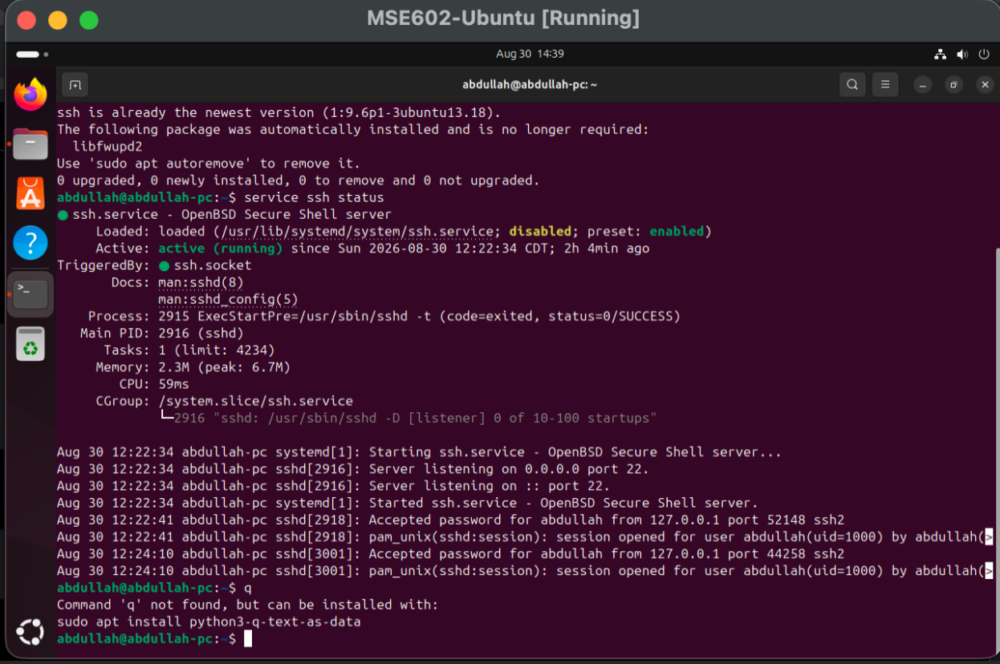

---

### Test SSH Loopback Connection

The SSH connection was tested locally using the loopback address `127.0.0.1` to confirm the service was accepting connections.

```bash
ssh osboxes@127.0.0.1
exit
```

**Screenshot sc2 – Successful SSH Connection:**

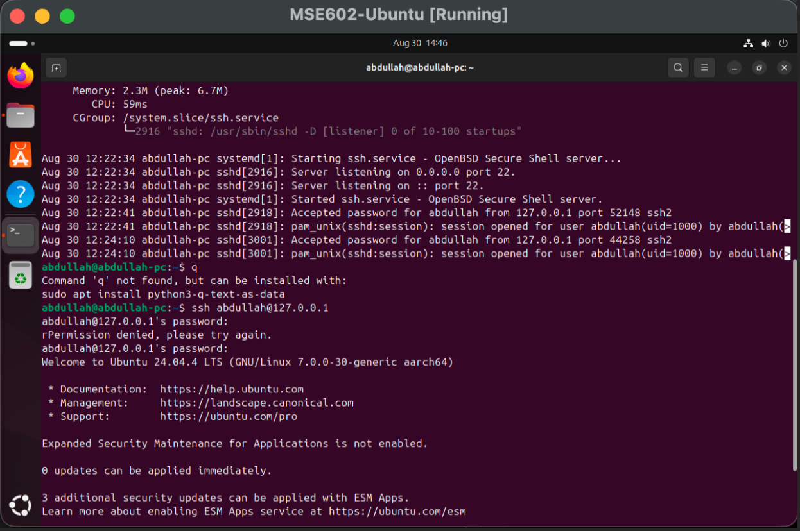

---

## Section 2: Python and Pip Verification

Python 3 was already installed on the Ubuntu VM. The version was confirmed and `pip3` was installed for managing Python packages.

```bash
python3 --version
sudo apt install python3-pip
pip3 --version
pip --help
```

**Screenshot sc3 – Python3 Version and Pip Installation:**

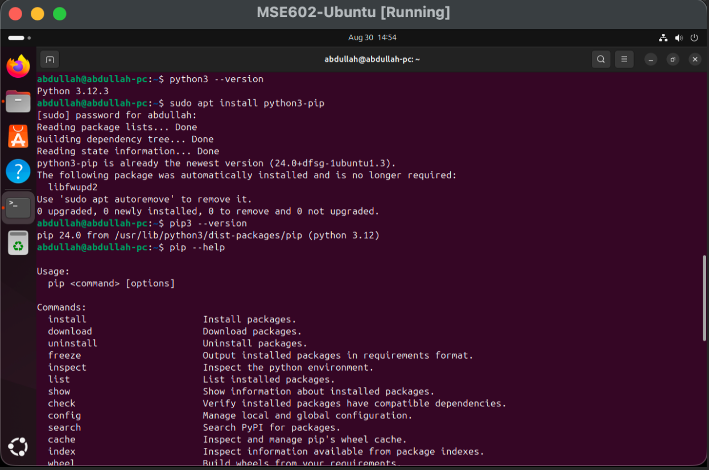

---

## Section 3: Git Installation

Git was installed to enable cloning of remote repositories. This is a foundational DevOps tool for version-controlled infrastructure and scripts.

```bash
sudo apt install git
git --version
```

**Screenshot sc4 – Git Version:**

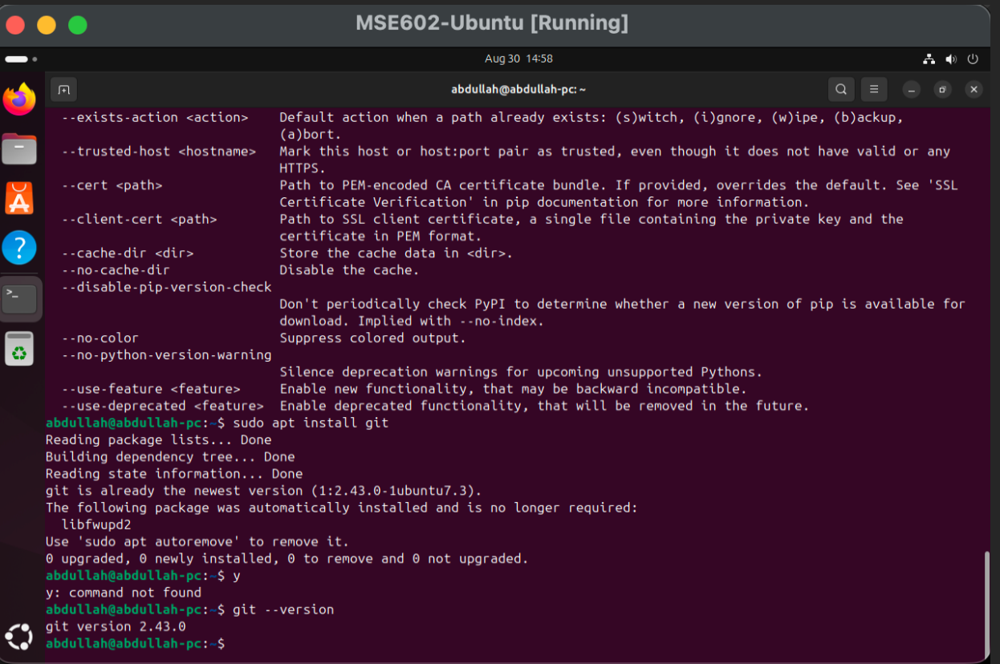

---

## Section 4: Clone the Project Repository

A project directory was created and the MSES602 DevOps utilities repository was cloned from GitHub. The Python scripts were located inside the cloned directory.

```bash
cd
mkdir Projects
cd Projects
git clone https://github.com/RegisUniversity/MSES602_DevOpsUtils.git
ls
cd ./MSES_DevOpsUtils/src/python3
ls
```

**Screenshot sc5 – Cloned Repository and Python Files:**

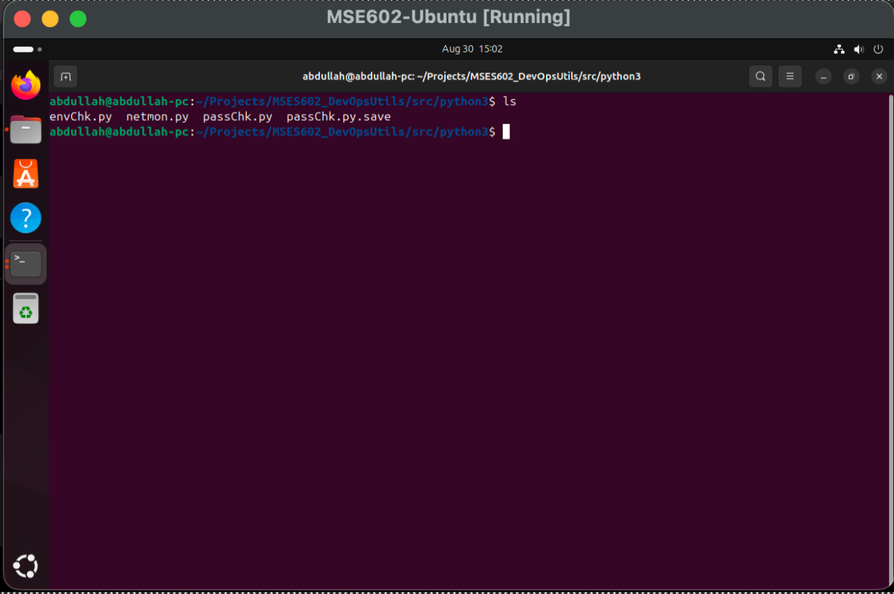

---

## Section 5: Running passChk.py – Password Security Audit

The `passChk.py` script scans all user accounts on the Ubuntu image and flags any accounts with short usernames or passwords that would be easily guessed by brute-force tools.

```bash
python3 passChk.py
```

**Screenshot sc6 – passChk.py Output:**

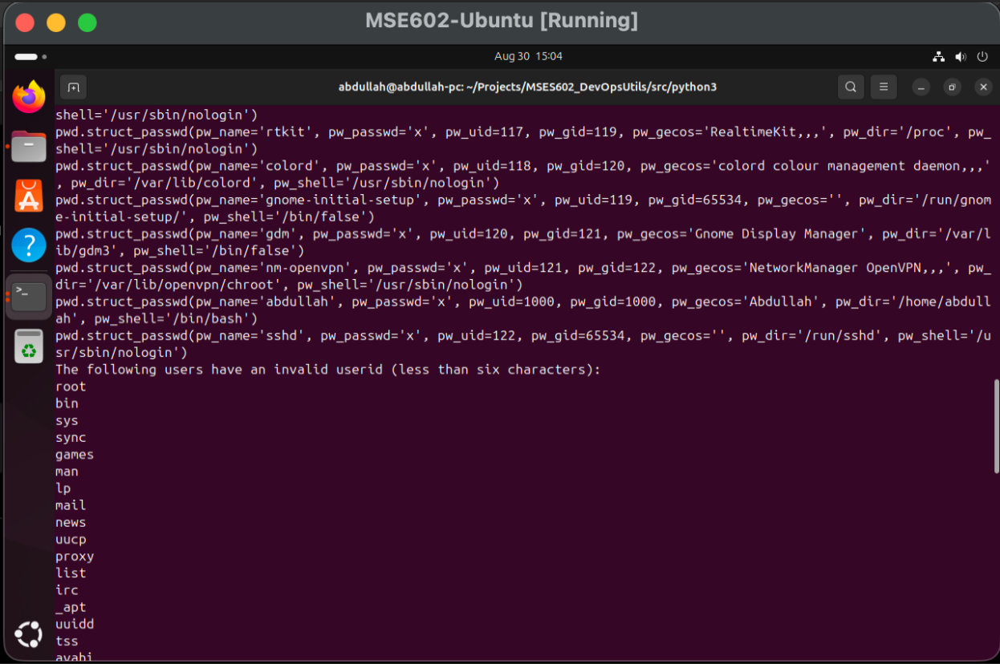

---

### Reviewing the passChk.py Source Code

The script was opened in `nano` to review how it reads the system user and password files and applies its security checks.

```bash
nano passChk.py
```

**Screenshot sc7 – passChk.py Source Code:**

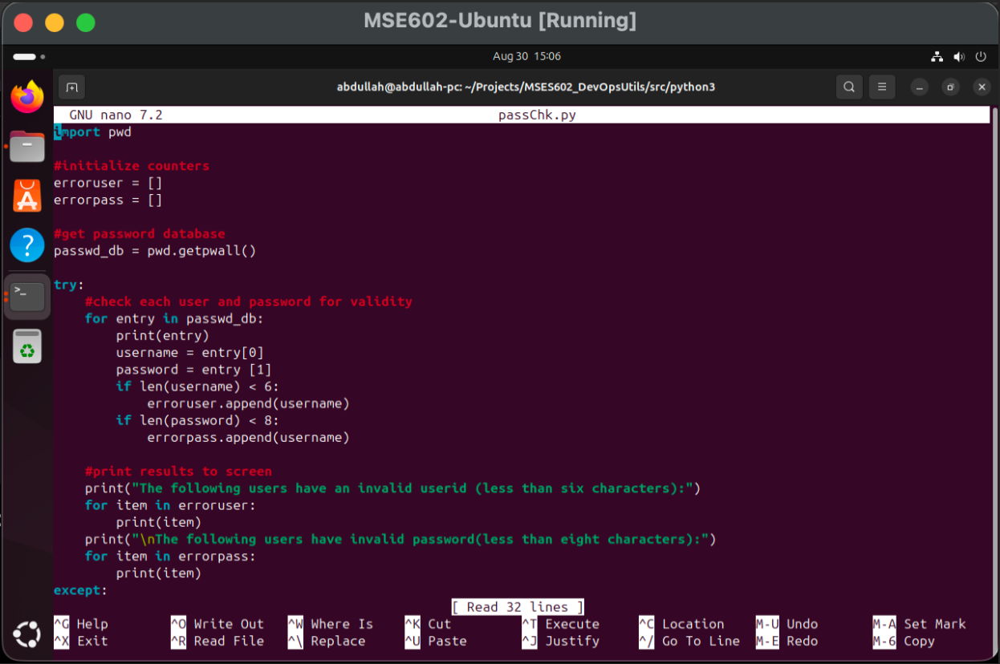

**Observation:** Most flagged accounts are system-level accounts. Automating this check daily would be far more practical than manually reviewing the files each time.

---

## Section 6: Running netmon.py – Network Monitor

The `netmon.py` script monitors network connectivity and reports whether the network is up or down. It sleeps between checks and can be extended to take automated action on failure.

```bash
python3 netmon.py
```

**Screenshot sc8 – netmon.py Running:**

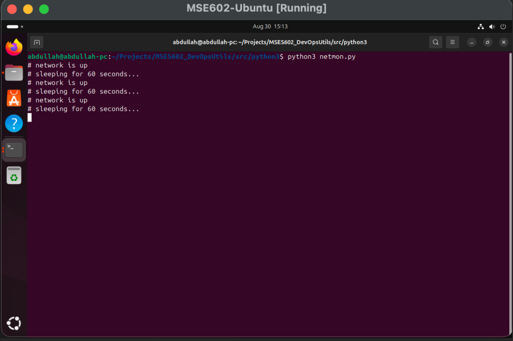

---

## Section 7: Extended envChk.py – System Environment Check

For the final task, the `envChk.py` script was extended with additional system metrics beyond the original. The new script (`lab1.py`) was written to include:

- System information (OS, hostname, machine)
- CPU usage (cores and current utilization)
- Memory usage (total, available, used)
- Disk usage (total, used, free)
- Network I/O counters
- **SSH connectivity check** – verifies port 22 is reachable on localhost
- System uptime since last boot
- Logged-in users
- Running process count
- Automated status warnings for CPU, memory, and disk thresholds

### Extended Script: `lab1.py`

```python
"""
MSES602 - Lab #1: Introduction to DevOps - Traditional Ops with Python
System environment check script (extends envChk.py with an SSH reachability check).
"""

import psutil
import platform
import socket
from datetime import datetime


def print_section(title):
    print()
    print("=" * 60)
    print(title)
    print("=" * 60)


print_section("SYSTEM INFORMATION")
print("Operating System:", platform.system())
print("OS Version:", platform.version())
print("Machine:", platform.machine())
print("Hostname:", socket.gethostname())

print_section("CPU INFORMATION")
print("CPU Cores:", psutil.cpu_count(logical=False))
print("Logical CPUs:", psutil.cpu_count(logical=True))
cpu_usage = psutil.cpu_percent(interval=1)
print("Current CPU Usage:", cpu_usage, "%")

print_section("MEMORY INFORMATION")
memory = psutil.virtual_memory()
print("Total Memory:", round(memory.total / (1024 ** 3), 2), "GB")
print("Available Memory:", round(memory.available / (1024 ** 3), 2), "GB")
print("Used Memory:", round(memory.used / (1024 ** 3), 2), "GB")
print("Memory Usage:", memory.percent, "%")

print_section("DISK INFORMATION")
disk = psutil.disk_usage("/")
print("Total Disk Space:", round(disk.total / (1024 ** 3), 2), "GB")
print("Used Disk Space:", round(disk.used / (1024 ** 3), 2), "GB")
print("Free Disk Space:", round(disk.free / (1024 ** 3), 2), "GB")
print("Disk Usage:", disk.percent, "%")

print_section("NETWORK INFORMATION")
network = psutil.net_io_counters()
print("Bytes Sent:", round(network.bytes_sent / (1024 ** 2), 2), "MB")
print("Bytes Received:", round(network.bytes_recv / (1024 ** 2), 2), "MB")

print_section("SSH CONNECTIVITY")
ssh_host = "127.0.0.1"
ssh_port = 22
try:
    with socket.create_connection((ssh_host, ssh_port), timeout=3):
        print(f"SSH port {ssh_port} on {ssh_host} is OPEN (reachable).")
except (socket.timeout, ConnectionRefusedError, OSError):
    print(f"SSH port {ssh_port} on {ssh_host} is NOT reachable.")

print_section("SYSTEM UPTIME")
boot_time = datetime.fromtimestamp(psutil.boot_time())
print("System Boot Time:", boot_time)
uptime_seconds = datetime.now().timestamp() - psutil.boot_time()
print("System Uptime:", round(uptime_seconds / 3600, 2), "hours")

print_section("LOGGED IN USERS")
users = psutil.users()
if users:
    for user in users:
        print("Username:", user.name)
        print("Terminal:", user.terminal)
        print("Login Time:", datetime.fromtimestamp(user.started))
else:
    print("No logged-in users found.")

print_section("RUNNING PROCESSES")
print("Number of Running Processes:", len(psutil.pids()))

print_section("SYSTEM STATUS")
print("WARNING: CPU usage is high." if cpu_usage > 80 else "CPU usage is normal.")
print("WARNING: Memory usage is high." if memory.percent > 80 else "Memory usage is normal.")
print("WARNING: Disk usage is high." if disk.percent > 80 else "Disk usage is normal.")

print()
print("System environment check completed.")
```

### Install psutil and Run the Script

```bash
pip3 install psutil
python3 lab1.py
```

**Screenshot sc9 – psutil Install and Script Output (Part 1):**

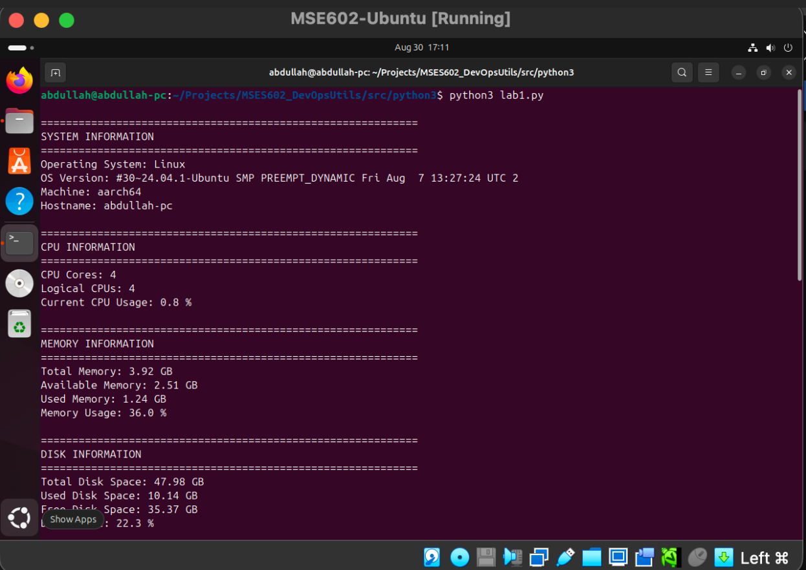

**Screenshot sc10 – Script Output (Part 2):**

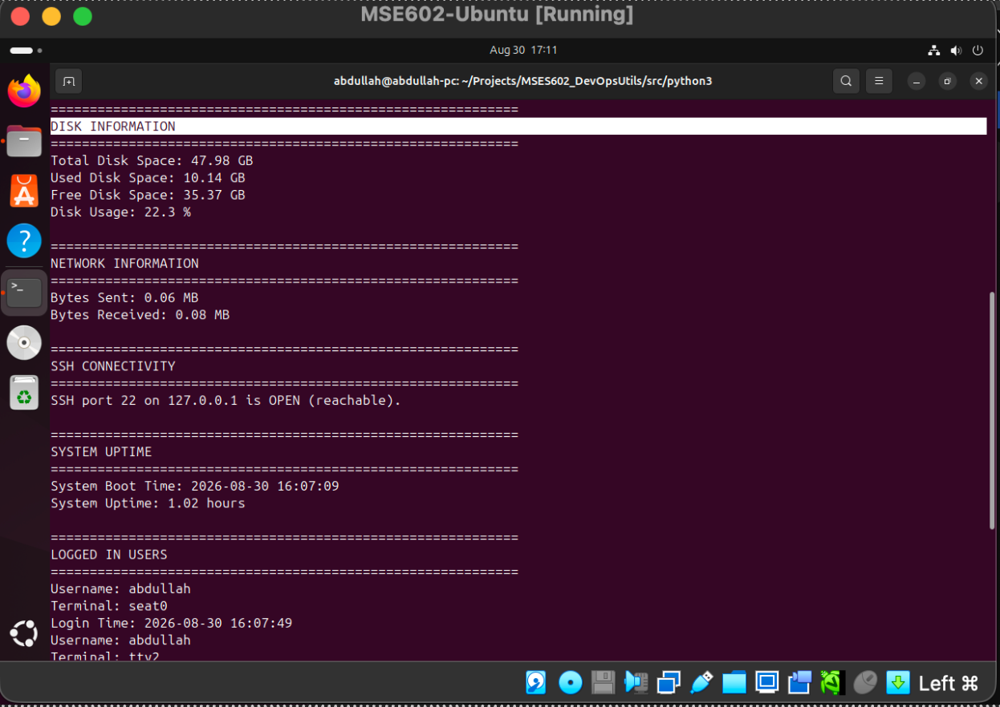

**Screenshot sc11 – Script Output (Part 3 – SSH Check and Status):**

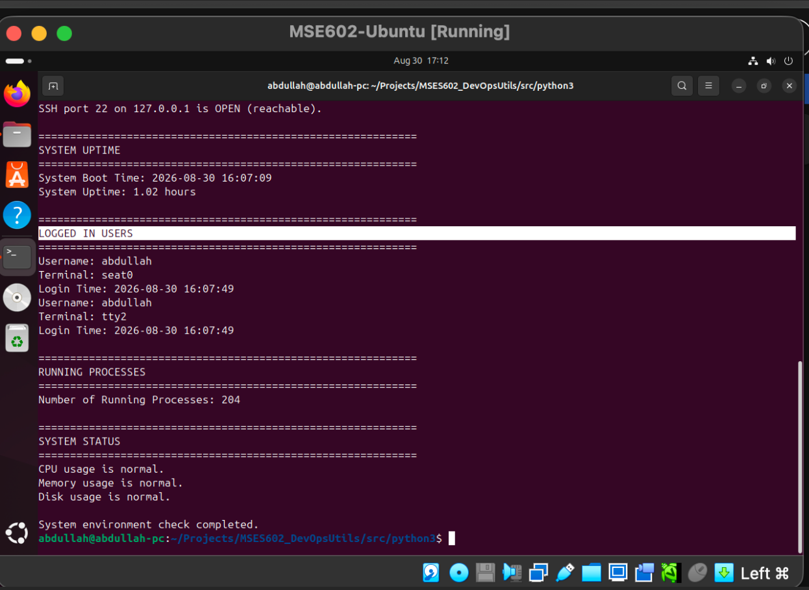

---

## Conclusion

This lab demonstrated traditional systems administration tasks on an Ubuntu VM, including SSH setup, Python scripting, and system monitoring. A key takeaway is that automating these tasks with Python eliminates manual effort, reduces errors, and enables repeatable, consistent system checks.

The extended `lab1.py` script goes beyond the original `envChk.py` by adding an **SSH connectivity check**, system uptime, logged-in users, process count, and threshold-based status warnings. These additions reflect practical, real-world operational monitoring concerns.

As emphasized in the DevOps Handbook, automation is central to the CAMS model (Culture, Automation, Measurement, Sharing). Scripts like these, stored and versioned in Git repositories, represent the shift from treating systems as "pets" to treating them as reproducible, disposable "cattle."

---

## References

- Willis, J., Debois, P., Humble, J., & Kim, G. (2021). *The DevOps Handbook, 2nd ed.* IT Revolution Press.
- Linuxize (2018). How to install Pip on Ubuntu 18.04.
- Menchaca, J. (2018). DevOps Concepts: Pets vs Cattle.
- Parkash, A. (2018). Using apt-get Commands in Linux.
- Rendek, L. (2018). Enable SSH on Ubuntu 18.04 Bionic Beaver Linux.
- psutil documentation: https://psutil.readthedocs.io/en/latest/
